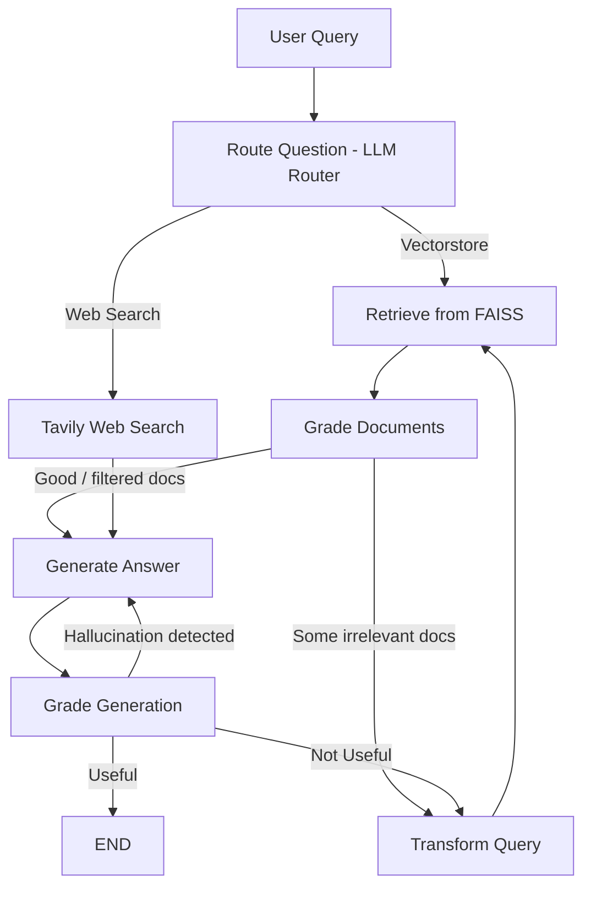

# Adaptive Multi-Source RAG Pipeline with Self-Correction

A dynamic, agentic Retrieval-Augmented Generation (RAG) system that routes queries between a vector database and web search, applies iterative retrieval refinement, and uses LLM-based evaluation to ensure grounded and high-quality responses.

Built using **LangGraph, LangChain, FAISS, OpenAI GPT-4o-mini, and Tavily Search API**.

---

## What this project does

This system goes beyond standard RAG. It behaves like an adaptive reasoning pipeline that can:

- Route queries between **vector store (FAISS)** and **web search (Tavily)**
- Retrieve and filter relevant documents using LLM-based grading
- Generate answers grounded in retrieved context
- Detect hallucinations in generated responses
- Evaluate answer quality against the original question
- Automatically rewrite queries when retrieval quality is poor
- Iterate until a useful response is produced

In short: it doesn’t just retrieve and answer — it self-corrects when it fails.

---
## Architecture

